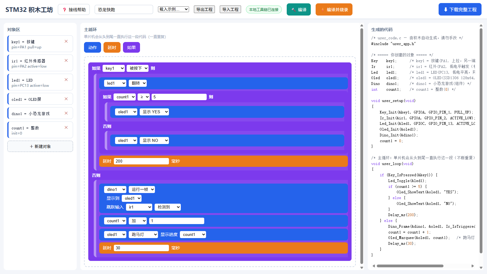
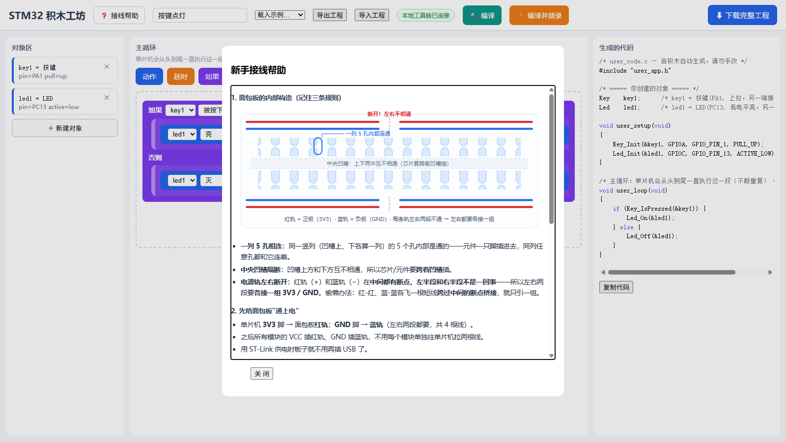

# STM32 积木工坊

拖拽积木 → 实时生成 C 代码 → 一键编译烧录。面向**没写过代码**的新同学：一块 STM32F103C8T6（蓝药丸）+ 一根 ST-Link，十分钟做出第一个作品。



左边定义对象（按键、红外、OLED、小恐龙……像 Python 里创建对象一样），中间拖积木拼主循环，右边实时生成对照的 C 代码——点「🔨 编译」「⚡ 编译并烧录」直接上板。

## 功能一览

**积木**

- 外设积木：按键 / 红外传感器 / LED / 蜂鸣器 / 舵机 / OLED 屏 / 整数变量，加 延时 / 如果-否则（C 形包裹显示、逐级缩进）
- OLED 玩法（每次只显示一样、大字体）：YES / NO / LOW / HIGH / 显示变量 / 最外圈 5px 跑马灯（进度 0~100，中间大字显示数值）
- 组件积木：小恐龙游戏（跑在 OLED 上；块内绑定「显示到」某块屏 + 「跳跃输入」某按键/红外或「外部钩子」，300ms 跳跃冷却；钩子模式可由外层任意逻辑驱动跳跃）
- 引脚自由选、冲突自动拦截（含 OLED 固定占用 PB8/PB9）；积木与代码面板悬停联动

**体验**

- 内置 6 个示例一键载入：按键点灯 / 按键组合技 / 舵机来回摆 / 红外感应灯 / 跑马灯进度圈 / 小恐龙游戏
- 内置「❓ 接线帮助」：面包板结构图解（电源轨左右断开、中央凹槽）、供电方法、模块接线表、SWD 下载线
- 生成的即为完整 CMake 工程（HAL + 手写精简 BSP，含 `.vscode` 一键配置），也可下载 zip 进 VSCode F5 单步调试
- 零构建静态网页、零 npm 依赖、断网可用

<details>
<summary>❓ 接线帮助界面（点开看）</summary>



</details>

## 快速开始

### 第 0 步：把工具拿到本地（有便携 U 盘就跳到第 1 步）

```bash
git clone https://github.com/hanasite/stm32-blocks.git
```

不用 git 的话：在 GitHub 页面点 **Code → Download ZIP**，解压到任意文件夹即可。

### 第 1 步：启动 WebUI

WebUI 就是一个网页，**双击对应文件就开**：

| 你的情况 | 双击这个文件 | 会发生什么 |
|---|---|---|
| 笔记本已装工具链 | 仓库根目录的 **`启动本地编译服务.bat`** | 弹出一个黑色命令行小窗口（这是本地服务，**使用时别关它**）→ 浏览器自动打开 `http://127.0.0.1:8899` → 页头出现绿色徽标「本地工具链已连接」——WebUI 就开好了 |
| 有便携 U 盘 | U 盘根目录的 **`启动本地编译服务-便携.bat`** | 同上，零安装 |
| 没装任何东西，只想先玩 | `web` 文件夹里的 **`index.html`** | 浏览器直接打开页面（离线模式：拼积木/看代码/示例/接线帮助都能用，编译按钮自动隐藏） |

> 浏览器没有自动弹出？手动在地址栏输入 **`http://127.0.0.1:8899`**。
> 以后再想用：重复第 1 步即可；关掉那个命令行窗口 = 关闭工具。

### 第 2 步：五分钟做出第一个作品

1. 页头的示例菜单选 **「按键点灯」**——左边出现 `key1`、`led1` 两个对象，右边是实时生成的 C 代码
2. 中间画布拖一块「延时」或「如果」进来，看右边代码跟着变（鼠标悬停积木，对应代码行会高亮）
3. 点 **「🔨 编译」**，几秒后弹出「✅ 编译成功」
4. 插好 ST-Link 点 **「⚡ 编译并烧录」**——按 PA1 的键：板载 LED 亮，松手灭
5. 进阶：载入 **「小恐龙游戏」** 示例（需 OLED + 红外模块），挥手让恐龙跳起来

### 还没装 Node / CubeCLT，或第 1 步报错？

[docs/部署指南.md](docs/部署指南.md) 有逐场景的安装步骤、下载渠道（含国内加速）和常见坑清单。

下面是各场景的详细步骤：

### A. 现场直连模式（推荐：自带/现场笔记本，不用 VSCode）

本机装好 [STM32CubeCLT](https://www.st.com/en/development-tools/stm32cubeclt.html)（默认 `D:\STM32CubeCLT_1.18.0`，可用环境变量 `CUBECLT` 指向其它路径；国内可从 [FubeMX](https://fubemx.keysking.com) 下载）与 Node.js，然后：

1. 双击 **`启动本地编译服务.bat`** —— 自动打开浏览器到 `http://127.0.0.1:8899/`，页头出现「本地工具链已连接」徽标
2. 拼积木 → 点 **「🔨 编译」**（约 3 秒出结果；代码有错会直接显示编译日志）
3. 插好 ST-Link → 点 **「⚡ 编译并烧录」** → 板子按积木逻辑动

产物工程在 `local-builds/<工程名>/`，也可拿它进 VSCode F5 单步调试。**不启动服务时这两个按钮自动隐藏**，网页功能与纯离线模式完全一致。

### B. 分发模式（别人的电脑）

1. 双击 `web/index.html` 拼积木 → 点「⬇ 下载完整工程」得到 `<工程名>.zip`
2. 解压 → VSCode 打开文件夹 → 按 F5 自动构建+烧录

需要对方自行安装 STM32CubeCLT 与 cortex-debug 扩展（模板自带 `.vscode/` 配置与一键脚本，无需其它设置）。

### C. 便携 U 盘模式（零安装，自带 Node + CubeCLT）

双击 **`制作便携U盘.bat`**（或 `node tools/make-portable.js <目标目录>`）生成约 2.5GB 的便携版；插到任何 Windows 电脑双击 `启动本地编译服务-便携.bat` 即用，盘符变了也不受影响。重复运行脚本 = 增量更新。

**详细安装说明（下载渠道、验证清单、常见坑）：[docs/部署指南.md](docs/部署指南.md)；给 AI 助手的版本：[docs/部署指南-Agent.md](docs/部署指南-Agent.md)。**

## 物料清单

跑通全部 6 个示例所需的硬件，按一套（一人份）计约 ¥60~80：

| 物料 | 数量 | 用途 / 备注 | 参考价* |
|---|---|---|---|
| STM32F103C8T6 最小系统板（蓝药丸） | ×1 | 主角。板载 PC13 LED——「按键点灯」连灯都不用外接 | ¥10~15 |
| ST-Link V2 下载器 | ×1 | 烧录/调试。克隆版可用；VSCode 调试（F5）需固件 V2J48+ | ¥10~15 |
| 面包板（400 或 830 孔） | ×1 | 接线底座。**电源轨左右断开**，用法见工具内「❓ 接线帮助」 | ¥5~10 |
| 杜邦线（公对公 + 公对母） | 各一扎 | 接线 | ¥5~8 |
| 0.96 寸 OLED（SSD1306，128×64，I2C） | ×1 | 大字显示 / 跑马灯 / 小恐龙游戏 | ¥8~15 |
| 红外避障传感器模块（数字输出） | ×1 | 「红外感应灯」「小恐龙跳跃输入」；绝大多数是低电平触发 | ¥2~4 |
| 有源蜂鸣器模块 | ×1 | 「按键组合技」用；买**高电平触发**款 | ¥2~3 |
| SG90 舵机（9g） | ×1 | 「舵机来回摆」「按键组合技」用；VCC 接板子 5V | ¥6~10 |
| 轻触按键（裸按键即可） | ×1 | 一端 → PA1，另一端 → GND（积木里配「上拉」） | ¥0.5 |
| 220Ω 电阻（可选） | ×2 | 仅外接 LED 灯珠时需要；用板载 LED 则免 | — |

\* 参考价为 2026 年十月前后淘宝散买的大致行情，仅供采购预算参考。

**最小体验套装**（只想先玩「按键点灯」）：蓝药丸 + ST-Link + 一个轻触按键，配合面包板和几根线即可；OLED/红外/蜂鸣器/舵机按需再补。

两个选型注意：

- 蜂鸣器买「**高电平触发**」款、红外买「**低电平触发**」款——积木默认值对齐它们开箱即用（买错了也能在对象里改选项适配）
- 舵机从板子 5V 脚直接供电即可（单个 SG90 演示足够）；多个舵机同时用建议外部 5V 供电、与板子共地

完整接线表：工具内「❓ 接线帮助」，或 `template/使用说明.md`。

## 项目结构

```
web/        零构建前端：编辑器（catalog/codegen/render…）、本地服务客户端、无头自检页
tools/      本地编译服务 serve.js、模板内嵌 embed-template、示例编译回归、便携版打包
template/   STM32 工程模板：手写 BSP 驱动 + CMake/Ninja + .vscode 配置（zip 与直连编译的底座）
tests/      node --test 单元测试（含 golden 测试逐字符锁定生成代码格式）
docs/       设计文档、部署指南、实施计划与踩坑记录
```

## 开发与贡献

- 质量门：`node --test`（42 项全绿）/ `node tools/run-example-builds.js`（6/6 真编译）/ Edge 无头 UI 自检（离线 57 项、本地服务在线 59 项）
- ⚠️ **改动 `template/` 后必须重跑 `node tools/embed-template.js`**，否则网页内嵌的还是旧模板
- 想加新组件/外设？看 [CONTRIBUTING.md](CONTRIBUTING.md) 的完整清单；提 PR 按模板勾选，先提 [组件提案](issues/new?template=component-proposal.md) 对齐设计
- 便携版打包/更新：`node tools/make-portable.js <目标目录>`

## License

本项目代码采用 MIT 许可证（见 [LICENSE](LICENSE)）；`template/Drivers/` 下为 ST 官方 HAL/CMSIS 源码，遵循其自带 BSD-3 许可证（见 `template/Drivers/LICENSE.md`）。
